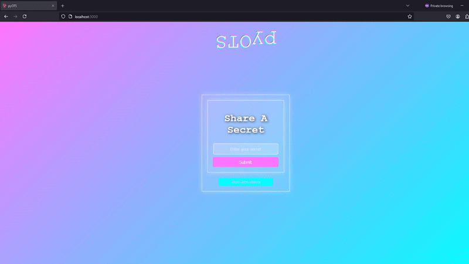

# pyOTS: One-Time Secret Sharing App

## Overview

pyOTS is a secure and easy-to-use one-time secret sharing application. The app enables users to share confidential information with a unique, single-use link. Built with React for the frontend and FastAPI for the backend.

## Features

- **One-Time Secret Links**: Generates a link for each secret that becomes invalid after a set number of views.
- **Customizable Viewing Limit**: Allows you to set a limit on the number of views per secret.
- **Automatic Deletion**: Secrets are deleted after reaching their view limit.
- **Secure ID Generation**: Uses UUIDs for enhanced security.

## Tech Stack

- **Frontend**: React, styled-components
- **Backend**: FastAPI, SQLite for database storage

## Installation & Setup

1. Clone the repository:
```
git clone https://github.com/Maty-0/pyOTS.git
```
2. Install dependencies for the backend:
```
cd pyOTS/backend pip install -r requirements.txt
```
3. Start the backend server:
```
python -m uvicorn main:app --reload
```
4. Install dependencies and start the frontend:
```
cd ../frontend npm install npm start
```
## Future Improvements

- Encrypt secrets
- Adding a password-based decryption feature for added security.
- Integrating email notifications for secret sharing.